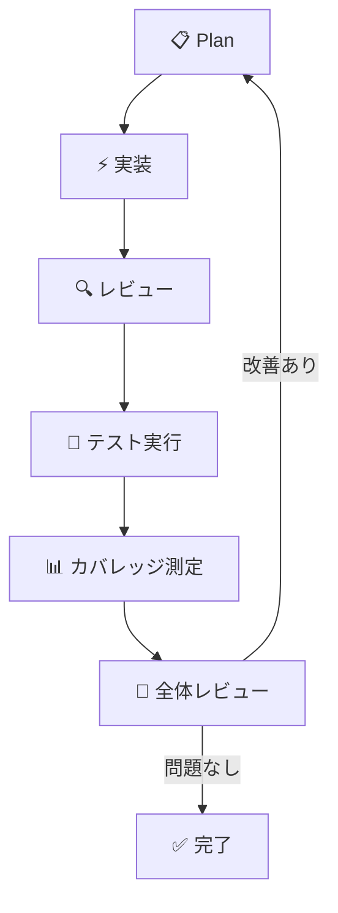

## はじめに

GitHub Copilotのagent機能、触っていますか？

ここ数ヶ月でagent機能が急速に進化しており、単なるコード補完ツールから**開発プロセスを自律的に回せるパートナー**へと変貌を遂げています。

本記事では、`.agent.md`を活用した**オーケストレーターパターン**を中心に、リクエスト数を半減させながら品質も担保する実践的な使い方を紹介します。

## オーケストレーターとは

通常、Copilot agentに複雑なタスクを依頼すると、計画・実装・レビューと何度もやり取りが発生します。10回を超えるのやり取りを覚悟するような長期タスクも珍しくありません。

**オーケストレーターパターン**では、全体を統括するエージェントが タスクを分解し、専門のサブエージェントに振り分けます。これにより、やり取りが**約半分（5回程度）**で済むようになります。

仕組みはシンプルで、`.agent.md`ファイルを複数用意し、メインのオーケストレーターが適切なサブエージェントを呼び出す形です。サブエージェントはそれぞれ単独でも呼び出せるため、再利用性も高い設計になります。

## サブエージェント設計 — 技術スタック × 役割で分ける

サブエージェントは**技術スタック**と**役割**の掛け合わせで設計します。以下はモノレポ構成での例です。

### オーケストレーター（全体統括）

```markdown
<!-- orchestrator.agent.md -->
# オーケストレーター

あなたはプロジェクト全体を統括するエージェントです。

## 役割
- ユーザーのリクエストを分析し、適切なサブエージェントにタスクを振り分ける
- 各サブエージェントの成果物を統合し、全体の整合性を確認する

## タスク振り分けルール
- Java API/バッチの調査 → `java-researcher`
- Java API/バッチの実装 → `java-coder`
- Javaコードのレビュー → `java-reviewer`
- フロントエンドの調査 → `frontend-researcher`
- フロントエンドの実装 → `frontend-coder`
- フロントエンドのレビュー → `frontend-reviewer`
- 全体の品質確認・改善 → `quality-reviewer`

## 作業前の必須事項
- `docs/knowledge.md` を参照し、過去の知見を確認すること

## 作業後の必須事項
- 新たな知見があれば `docs/knowledge.md` を更新すること
```

### Java調査エージェント

```markdown
<!-- java-researcher.agent.md -->
# Java調査エージェント

あなたはJavaの技術調査に特化したエージェントです。

## 役割
- 既存コードベースの構造・依存関係を調査する
- 影響範囲の分析とリスク評価を行う
- 実装方針をドキュメントにまとめる

## 対象
- API（Helidon / WebLogic）
- バッチ処理

## 調査時のルール
- 既存の設計パターン・命名規則を尊重すること
- 影響範囲は必ずリスト化すること
```

### Javaコード生成エージェント

```markdown
<!-- java-coder.agent.md -->
# Javaコード生成エージェント

あなたはJavaの実装に特化したエージェントです。

## 役割
- 調査エージェントの方針に基づいてコードを実装する
- 既存コードの規約・パターンに厳密に従う

## 実装ルール
- 既存のコーディング規約を遵守すること
- 新規クラス作成時は既存の類似クラスを参考にすること
- TODOコメントを残さないこと
```

### Javaレビューエージェント

```markdown
<!-- java-reviewer.agent.md -->
# Javaレビューエージェント

あなたはJavaコードのレビューに特化したエージェントです。

## 役割
- 生成されたコードの品質をレビューする
- バグ、セキュリティリスク、パフォーマンス問題を検出する

## レビュー観点
- コーディング規約への準拠
- エラーハンドリングの適切さ
- テスタビリティ
- 既存コードとの一貫性
```

### フロントエンドコード生成エージェント

```markdown
<!-- frontend-coder.agent.md -->
# フロントエンドコード生成エージェント

あなたはVue.jsの実装に特化したエージェントです。

## 役割
- コンポーネントの実装
- 既存のデザインシステム・UIパターンに従う

## 実装ルール
- Composition APIを使用すること
- コンポーネントは単一責任の原則に従うこと
- 型定義を省略しないこと
```

### 全体レビュー（自己改善エージェント）

```markdown
<!-- quality-reviewer.agent.md -->
# 品質レビュー・自己改善エージェント

あなたはプロジェクト全体の品質を担保するエージェントです。

## 役割
- フロントエンド・バックエンド横断でのレビュー
- テストカバレッジの測定と不足箇所の特定
- 改善が必要な場合、オーケストレーターに差し戻す

## レビューフロー
1. 全変更ファイルの整合性を確認
2. テストを実行しカバレッジを測定
3. 問題があれば具体的な改善指示を出す
4. 問題がなければ完了を宣言する
```

## 自己改善ループ

オーケストレーターとサブエージェントを組み合わせることで、以下の自己改善ループが**1つのインストラクション内で自律的に回ります**。



上手くいかなかった箇所はナレッジとして `docs/knowledge.md` に蓄積されます。次回の作業前に必ず参照し、同じ失敗を繰り返さない仕組みです。指摘が溜まってきたら、新たなサブエージェントのスキルとして切り出すことも検討できます。

## モデルの使い分け

Copilotでは複数のモデルを選択できます。タスクの性質に応じて使い分けることで、コストと品質のバランスを取れます。

|フェーズ |おすすめモデル                      |理由                 |
|-----|-----------------------------|-------------------|
|計画・設計|Claude Opus 4.6              |思考力が必要な場面に強い       |
|実装   |Claude Sonnet 4.6 / Codex 5.4|コスパが良く十分な品質        |
|レビュー |Claude Opus 4.6              |見落としを減らすため高性能モデルを使用|

体感として、Codex 5.4はSonnet 4.6と品質に大きな差はありませんが、既存コードの規約に寄せた**保守的なコード**を出す傾向があります。既存プロジェクトへの追加実装では相性が良いです。

## まとめ

- **オーケストレーターパターン**でサブエージェントに振り分ければ、やり取り回数を約半分に削減できる
- サブエージェントは**技術スタック × 役割**で分け、単独でも再利用可能にする
- **自己改善ループ**をインストラクションに組み込めば、plan→実装→テスト→改善が自律的に回る
- **ナレッジ蓄積**で同じ失敗を繰り返さない仕組みを作れる
- **モデルの使い分け**で思考力とコスパを両立する

`.agent.md`ファイルを数個用意するだけで始められます。ぜひ試してみてください。
